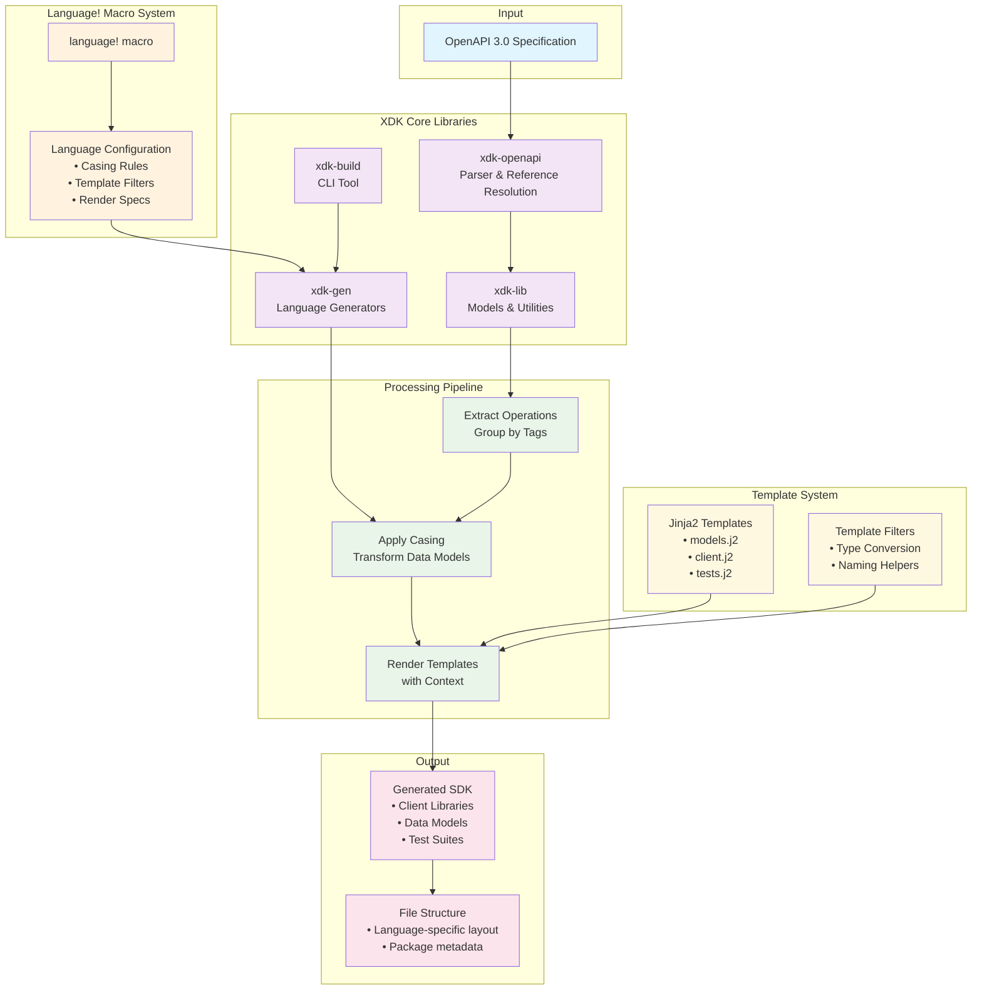

# XDK SDK Generator: Technical Architecture

## Overview

The XDK (X Development Kit) Generator is a powerful, language-agnostic SDK generation system that automatically creates Software Development Kits (SDKs) for the X API from OpenAPI 3.0 specifications. The system is designed with extensibility and maintainability at its core, using a macro-driven approach to minimize boilerplate while maximizing consistency across different target languages.

## Core Architecture



### 1. **Declarative Language Configuration**

The heart of the XDK generator is the `language!` macro, which allows developers to declaratively define an entire SDK generator for any programming language in a single, concise specification:

```rust
language! {
    name: Python,
    filters: [pascal_case, python_type, last_part],
    class_casing: Casing::Pascal,
    operation_casing: Casing::Snake,
    import_casing: Casing::Snake,
    variable_casing: Casing::Snake,
    render: [
        multiple {
            render "models" => "xdk/{}/models.py",
            render "client_class" => "xdk/{}/client.py",
            render "client_module" => "xdk/{}/__init__.py"
        },
        render "main_client" => "xdk/client.py",
        render "oauth2_auth" => "xdk/oauth2_auth.py",
        render "init_py" => "xdk/__init__.py"
    ],
    tests: [
        multiple {
            render "test_contracts" => "tests/{}/test_contracts.py",
            render "test_structure" => "tests/{}/test_structure.py",
            render "test_pagination" => "tests/{}/test_pagination.py"
        },
        render "conftest" => "tests/conftest.py"
    ]
}
```

This single declaration generates a complete, functional SDK generator that:
- Parses OpenAPI specifications
- Applies language-specific naming conventions
- Generates client libraries, models, and comprehensive test suites
- Handles complex scenarios like pagination, authentication, and error handling

### 2. **Language-Agnostic Processing Pipeline**

The XDK architecture separates concerns into distinct, reusable layers:

#### **OpenAPI Parsing Layer**
- Custom OpenAPI 3.0 parser with lazy reference resolution
- Strongly-typed representation of API specifications
- Support for complex schemas, inheritance, and component references

#### **Data Transformation Layer**
- Extracts operations, parameters, and schemas from OpenAPI specs
- Groups operations by tags for modular SDK organization
- Applies language-specific naming conventions consistently
- Generates comprehensive metadata for template rendering

#### **Template Rendering Engine**
- MiniJinja-powered templating system
- Language-specific filters and helpers
- Context-aware rendering with rich data models
- Support for conditional logic and complex iterations

#### **Test Generation System**
- Automatic generation of multiple test types:
  - **Contract Tests**: Validate API compliance
  - **Structure Tests**: Verify SDK interface correctness
  - **Pagination Tests**: Handle paginated endpoints
  - **Mock Scenarios**: Support offline development

## Key Technical Innovations

### 1. **Macro-Driven Code Generation**

The `language!` macro is a Rust declarative macro that expands into a complete `LanguageGenerator` implementation. This approach provides several benefits:

- **Zero Boilerplate**: Developers define behavior, not implementation
- **Compile-Time Validation**: Errors caught during compilation, not runtime
- **Consistent Architecture**: All generators follow the same patterns
- **Easy Maintenance**: Changes to the macro system benefit all languages

### 2. **Intelligent Naming Convention System**

The casing system automatically handles the complexities of cross-language naming:

```rust
// Input: "getUserProfile" (from OpenAPI)
// Outputs:
// Python:     get_user_profile (method), GetUserProfile (class)
// Java:       getUserProfile (method), GetUserProfile (class)  
// C#:         GetUserProfile (method), GetUserProfile (class)
```

The system understands various input formats:
- camelCase (`getUserId`)
- PascalCase (`GetUserId`)
- snake_case (`get_user_id`)
- kebab-case (`get-user-id`)

And converts them to any target convention with proper word boundary detection.

### 3. **Unified Data Models**

The system uses strongly-typed data structures that bridge the gap between OpenAPI specifications and target language requirements:

```rust
pub struct OperationInfo {
    pub class_name: String,     // GetUserProfile
    pub method_name: String,    // get_user_profile  
    pub method: String,         // GET
    pub path: String,           // /users/{id}/profile
    pub parameters: Option<Vec<ParameterInfo>>,
    pub request_body: Option<RequestBody>,
    pub responses: HashMap<StatusCode, Response>,
}

pub struct ParameterInfo {
    pub original_name: String,   // userId (from OpenAPI)
    pub variable_name: String,   // user_id (language-specific)
    pub location: String,        // path, query, header
    pub required: bool,
    pub param_type: String,
    pub description: Option<String>,
}
```

### 4. **Context-Rich Template System**

Templates receive rich, pre-processed contexts that eliminate the need for complex template logic:

```jinja2

class {{ operation.class_name }}:
    def {{ operation.method_name }}(self,
        
        {{ param.variable_name }}: {{ param.param_type }},
        
    ):
        # Implementation

```

## End-to-End Generation Flow

### Phase 1: **OpenAPI Analysis**
1. Parse OpenAPI specification into strongly-typed structures
2. Resolve all `$ref` references lazily as needed
3. Extract operations, grouping by tags for modular organization
4. Analyze parameters, request/response schemas, and security requirements

### Phase 2: **Language-Specific Processing**
1. Apply naming conventions based on language configuration
2. Transform OpenAPI operations into language-specific data models
3. Generate test specifications with proper parameter casing
4. Create rich context objects for template rendering

### Phase 3: **Code Generation**
1. Render main SDK files (clients, models)
2. Generate comprehensive test suites
3. Create package configuration files
4. Apply language-specific formatting and structure

### Phase 4: **Output Organization**
1. Create appropriate directory structures
2. Write all generated files to target locations
3. Ensure proper file permissions and encoding
4. Generate package metadata and documentation

## Extensibility Architecture

### Adding New Languages

Creating support for a new language requires only:

1. **Language Configuration**: Define the `language!` macro call
2. **Template Creation**: Write Jinja2 templates for the target language
3. **Language-Specific Filters**: Add any custom template filters needed

Example for adding Rust SDK generation:

```rust
language! {
    name: Rust,
    filters: [rust_type, snake_case, pascal_case],
    class_casing: Casing::Pascal,
    operation_casing: Casing::Snake,
    import_casing: Casing::Snake,
    variable_casing: Casing::Snake,
    render: [
        multiple {
            render "models" => "src/{}/models.rs",
            render "client" => "src/{}/client.rs",
        },
        render "lib" => "src/lib.rs",
        render "cargo_toml" => "Cargo.toml"
    ],
    tests: [
        multiple {
            render "tests" => "tests/{}/mod.rs",
        }
    ]
}
```

### Template System Features

Templates have access to powerful features:

- **Language-Specific Filters**: Type conversion, naming conventions
- **Rich Context Objects**: Pre-processed data with all necessary information
- **Conditional Logic**: Handle optional parameters, different response types
- **Iteration Support**: Process collections of operations, parameters, schemas

### Test Generation Framework

The test generation system automatically creates:

- **Contract Tests**: Verify API responses match OpenAPI specifications
- **Structure Tests**: Ensure SDK interfaces are correctly generated
- **Pagination Tests**: Handle APIs with cursor or offset-based pagination
- **Mock Scenarios**: Support offline development with realistic test data


## Architecture Components

### Core Libraries
- **xdk-openapi**: OpenAPI 3.0 parser with reference resolution
- **xdk-lib**: Shared utilities, models, and generation logic
- **xdk-gen**: Language-specific generators using the `language!` macro
- **xdk-build**: CLI tool for invoking generators

### Data Flow
1. OpenAPI specification parsed into typed structures
2. Operations extracted and grouped by tags
3. Language-specific naming conventions applied
4. Templates rendered with processed contexts
5. Files written to output directory structure